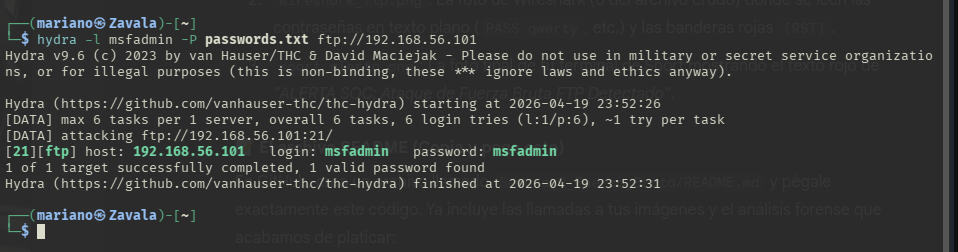
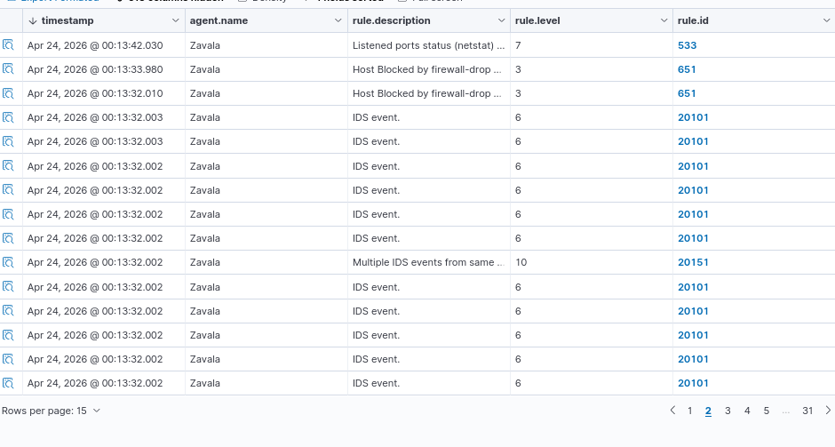
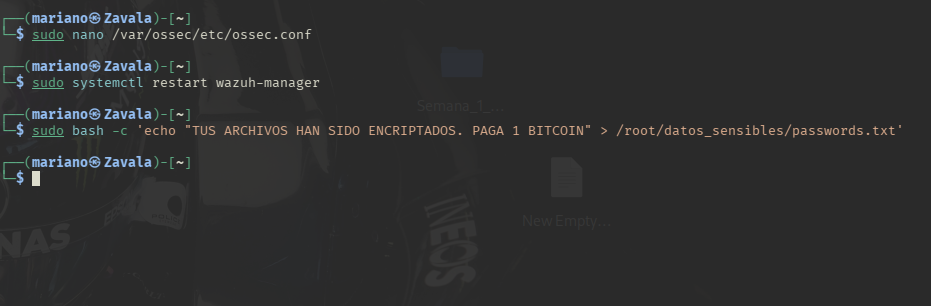
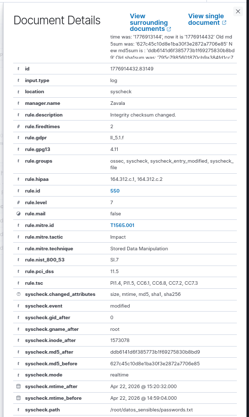

# 🛡️ Laboratorio SOC & XDR: Integración Wazuh SIEM + Snort NIDS

## 📌 Resumen del Proyecto
Este repositorio documenta el diseño y la implementación de un entorno de operaciones de seguridad (SOC) de nivel profesional. Se desarrolló una arquitectura XDR (Extended Detection and Response) capaz de monitorizar la actividad de los endpoints (HIDS), analizar el tráfico de red (NIDS) e integrar respuestas automatizadas ante incidentes.

Este proyecto demuestra capacidades prácticas en defensa cibernética, monitorización en tiempo real y respuesta a incidentes en entornos Linux.

## 🏗️ Arquitectura del Laboratorio
* **Nodo SIEM / Manager:** Kali Linux (Wazuh Manager + Snort 3).
* **Nodo Atacante / Víctima:** Metasploitable 2.
* **Interfaz de Red:** Adaptador Host-Only (`vboxnet0`) aislando el entorno de pruebas.

---

## 🚀 Implementaciones Técnicas y Casos de Uso

### 1. Detección de Fuerza Bruta (Red Team vs Blue Team)
Se simuló un ataque de fuerza bruta contra el protocolo FTP y se configuró un sensor de red para detectarlo.
* **Ataque (Red Team):** Uso de `Hydra` para vulnerar el servicio FTP, logrando obtener credenciales válidas (`msfadmin`).
* **Detección (Blue Team):** Se programó una regla personalizada en Snort (`local.rules`) que interceptó el tráfico y generó la alerta crítica *"ALERTA SOC: Ataque de Fuerza Bruta FTP Detectado"*.

*Ataque ejecutado con éxito desde el nodo atacante.*

*Motor NIDS detectando la firma del ataque en tiempo real.*

### 2. Detección de Red y Correlación en SIEM (Syslog)
Para asegurar la visibilidad en el SIEM, se integró Snort 3 con Wazuh.
* **Ataque ICMP:** Se configuraron reglas para detectar inundaciones de ping.
* **Pipeline Syslog:** Las alertas de Snort se redirigieron al kernel de Linux vía Syslog, permitiendo a Wazuh decodificarlas nativamente sin errores de parsing.

*Evidencia: Dashboard de Wazuh correlacionando eventos IDS (Reglas 20101/20151) y ejecutando mitigaciones.*

### 3. Mitigación Automatizada (Active Response)
Se configuró el motor de respuesta activa para neutralizar amenazas críticas de forma autónoma.
* **Configuración:** Edición del archivo `ossec.conf` para ejecutar el script `firewall-drop` al detectarse alertas de severidad Nivel 10.
* **Impacto:** Bloqueo automático de la IP atacante en el firewall local (iptables), cortando la comunicación maliciosa al instante.

*Bloque de código XML configurando la mitigación automática.*

### 4. File Integrity Monitoring (FIM) y Anti-Ransomware
Se habilitó el módulo `Syscheck` para proteger información confidencial.
* **Monitorización:** Inclusión del directorio `/root/datos_sensibles/` en el motor de monitoreo en tiempo real.
* **Simulación:** Modificación maliciosa del archivo `passwords.txt` simulando el comportamiento de un Ransomware ("TUS ARCHIVOS HAN SIDO ENCRIPTADOS...").
* **Auditoría Forense:** Wazuh detectó el evento, levantó una alerta Nivel 7 y documentó el cambio en los hashes criptográficos (MD5, SHA1) para asegurar la cadena de custodia.

*Evidencia: Modificación del archivo y reporte de alteración de Checksums en Wazuh.*

---

## 🛠️ Habilidades Técnicas Demostradas
* **Network Security:** Creación de reglas NIDS personalizadas e intercepción de tráfico.
* **Linux Sysadmin:** Manejo avanzado de permisos, edición de archivos de configuración `.conf`/`.xml` desde CLI y gestión de daemons.
* **Troubleshooting de SOC:** Resolución de problemas en pipelines de ingesta de logs (manejo de tuberías `tee`, redirección de standard error y decodificación de expresiones regulares).

## 💻 Stack Tecnológico
`Wazuh` | `Snort 3` | `Syslog` | `Bash Scripting` | `Hydra` | `Active Response` | `FIM (Syscheck)`
