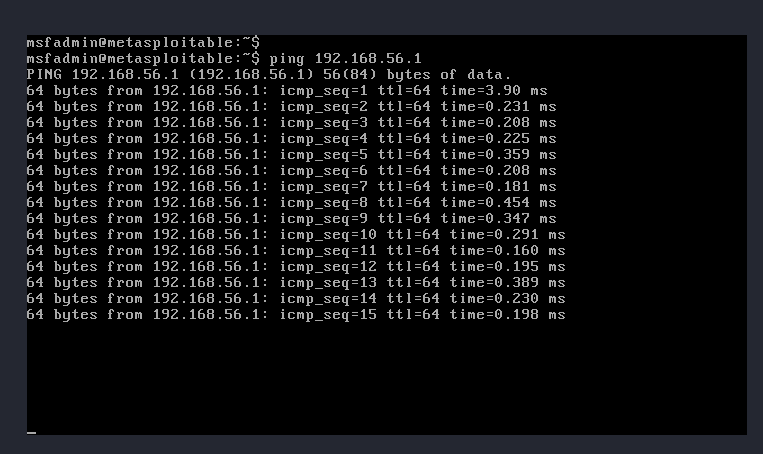
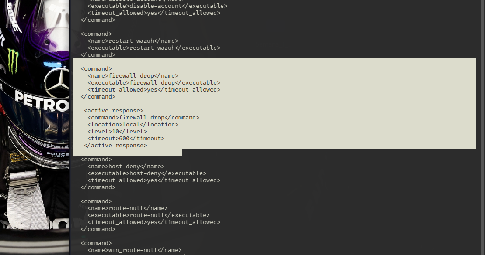
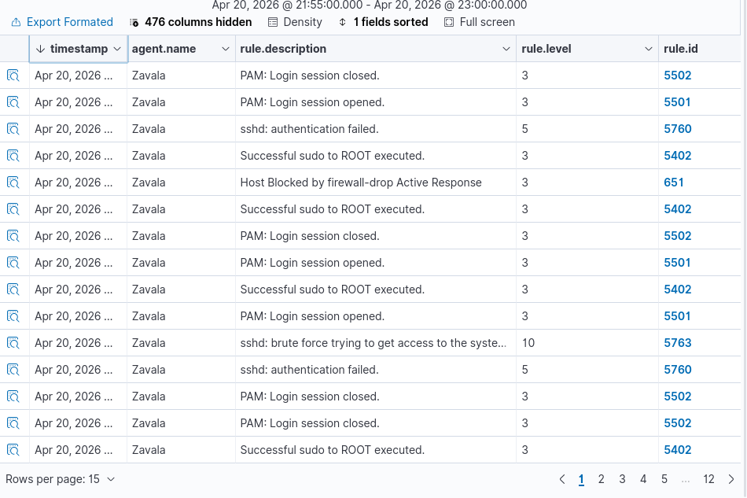

# 🛡️ Laboratorio SOC & XDR: Integración Wazuh SIEM + Snort NIDS

## 📌 Resumen del Proyecto
Este repositorio documenta el diseño y la implementación de un entorno de operaciones de seguridad (SOC) de nivel profesional. Se desarrolló una arquitectura XDR (Extended Detection and Response) capaz de monitorizar tanto la actividad de los endpoints (HIDS) como el tráfico de red (NIDS), integrando respuestas automatizadas ante incidentes.

Este proyecto forma parte de mi formación como Ingeniero en Tecnologías de la Información (ITI) y refleja mi especialización en herramientas de código abierto para la defensa cibernética.

## 🏗️ Arquitectura del Laboratorio
* **Nodo SIEM / Manager:** Kali Linux (Wazuh Manager + Snort 3).
* **Nodo Atacante / Víctima:** Metasploitable 2.
* **Interfaz de Red:** Adaptador Host-Only (`vboxnet0`) para un entorno seguro y aislado.

---

## 🚀 Implementaciones Técnicas

### 1. Detección de Intrusiones de Red (NIDS)
Se integró **Snort 3** como sensor de red para identificar patrones maliciosos en tiempo real. 
* **Reglas Personalizadas:** Se desarrolló una firma específica en `local.rules` para detectar inundaciones de paquetes ICMP (Ataques Ping).
* **Pipeline de Logs:** Las alertas se redirigieron mediante el protocolo **Syslog**, permitiendo que Wazuh decodifique los eventos de red sin errores de formato, facilitando la correlación de datos.

[cite_start]*Evidencia: Alertas de Snort capturadas por el motor de análisis de Wazuh.*

### 2. Respuesta Activa Automatizada
Se implementó un motor de **Active Response** para mitigar amenazas de forma autónoma sin intervención humana.
* **Escenario:** Ataque de fuerza bruta al servicio SSH mediante `Hydra`.
* **Lógica de Defensa:** Al detectar múltiples fallos de inicio de sesión (Nivel 10), el servidor ejecuta automáticamente el script `firewall-drop`.
* **Resultado:** Bloqueo inmediato de la IP del atacante, interrumpiendo el vector de ataque en progreso.

*Evidencia: Configuración del comando y la respuesta activa en el backend del SIEM.*

### 3. Monitorización de Eventos y Seguridad
El Dashboard de Wazuh centraliza toda la telemetría del laboratorio, permitiendo realizar **Threat Hunting** sobre diversos vectores de ataque, incluyendo escaneos de puertos y alteraciones de archivos.

[cite_start]*Evidencia: Visualización centralizada de eventos de seguridad y niveles de severidad.*

---

## 🛠️ Habilidades Demostradas (Troubleshooting)
Durante la construcción de este SOC, se resolvieron retos técnicos críticos que validan mi competencia técnica:
* **Depuración de Logs:** Uso de `wazuh-logtest` para validar la correcta decodificación de mensajes ASCII complejos.
* **Administración Linux:** Configuración avanzada de permisos de sistema y gestión de servicios (`systemd`).
* **Gestión de Redes:** Resolución de errores de DAQ en Snort y gestión de interfaces virtuales en entornos de virtualización.

## 💻 Stack Tecnológico
`Wazuh` | `Snort 3` | `Linux CLI` | `Syslog` | `Hydra` | `Active Response`
